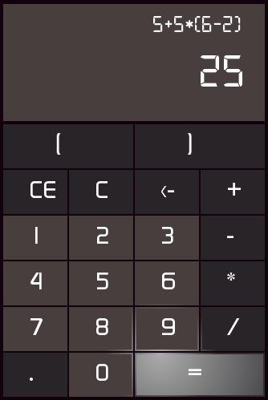

SFML Calculator
=======
Project of a simple math calculator build with SFML. It is written in C++ 14. Inspired a bit by the Windows calculator app.

# Technologies
* Visual Studio Community 16.8.2  
* Git 2.27.0
* GitHub.VisualStudio 2.11.106  
* SFML 2.5.1  
* CMake 3.18.4

# Interface
